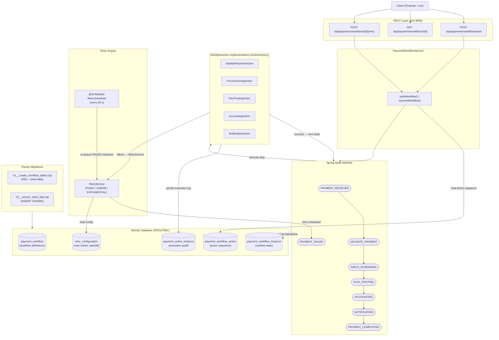
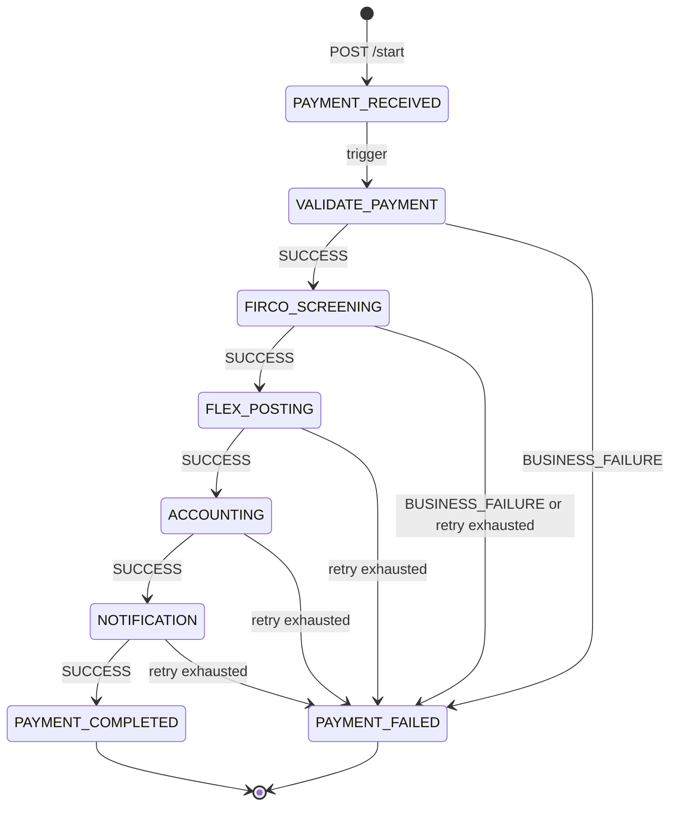
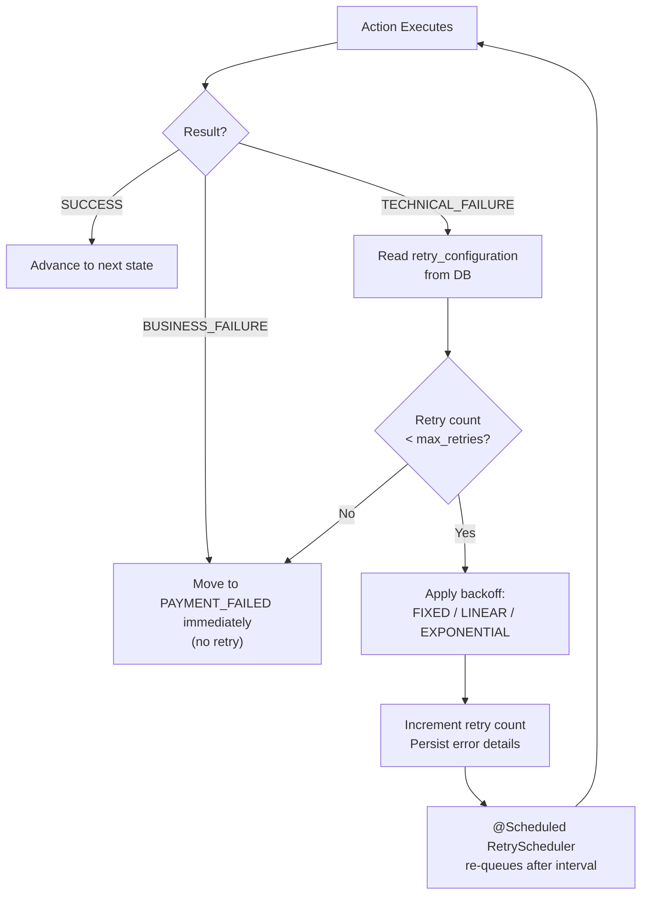

# Payment Workflow Orchestration — Architecture Flow Diagram

## End-to-End Architecture

## Payment Lifecycle State Diagram

## Retry Flow

## Component Map

| Layer | Class / Interface | Responsibility |
|-------|-------------------|----------------|
| Controller | `PaymentWorkflowController` | REST endpoints |
| Service | `PaymentWorkflowService` | Orchestration, idempotent execution |
| Factory | `ActionFactory` | Resolves `WorkflowAction` beans by name |
| Actions | `ValidatePaymentAction` … `NotificationAction` | Mock downstream integrations |
| Retry | `RetryService`, `RetryScheduler` | Backoff + scheduled re-try |
| State | Spring State Machine config | State / event definitions |
| Entities | `PaymentWorkflow`, `PaymentWorkflowAction`, `PaymentWorkflowInstance`, `PaymentActionInstance` | JPA persistence |
| DB | `retry_configuration` | DB-driven retry policy |
| Migration | `V1__create_workflow_tables.sql`, `V2__ensure_seed_data.sql` | Flyway DDL + seed |
